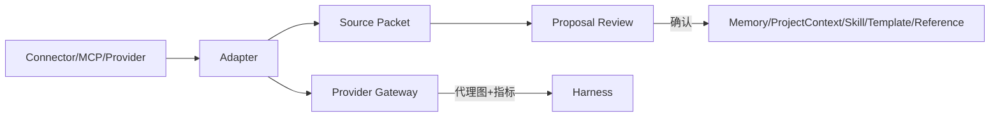

# 技术设计

## 架构概览

Connector Adapter 负责协议适配，Source Packet 负责来源封装，Proposal Service 负责审阅，Provider Gateway 负责脱敏和路由。所有外部结果只能进入候选或提案通道。

## 数据模型与接口

`ConnectorManifest` 包含 id、协议、inputs、capabilities、receiver；`SourcePacket` 包含 packetId、source、retrievedAt、contentHash、引用和敏感性标签。跨模块 `Proposal` 统一包含 `proposal_id`、`target_type`、`target_id`、`base_hash`、`patch`、`source_packet_ids`、`expires_at`、`status`、`applied_revision`。生命周期固定为 `preview → confirm/reject → apply`：confirm 只锁定用户意图，apply 在服务端重新校验基线、权限和冲突；操作必须幂等，过期或已应用提案不得重复写入。目标类型可包括 Memory、ProjectContext、Skill、Template 和 Reference。

- `ConnectorRegistry.list/connect/disconnect`
- `SourcePacketStore.put/get`
- `ProposalService.preview/confirm/reject/apply`
- `ProviderGateway.prepare(request)`：执行尺寸、EXIF、路径和接收方校验

`ProposalStore/ProposalService` 的唯一实现归属 Context/Memory Spec；其 `base_hash` 冲突检查、状态迁移、幂等键和 `applied_revision` 写入由该服务负责。Connector Spec 只实现 Source Packet 适配和目标类型适配器，不创建第二套 Proposal 服务。

支持 `workspaceItems`、`pluginIds`、`mcpServerIds`、`connectorIds` 的运行快照，保证一次运行的连接集合可复现。

## 测试策略

使用 Fake Connector/MCP/Provider，覆盖正常读取、提案拒绝、超时取消、晚到隔离、SSRF、路径遍历、密钥脱敏和 Provider 不自动降级。测试不触网、不访问真实用户目录。

## 安全考虑

连接凭据存放在系统安全存储，日志仅记录引用和摘要。网络请求解析 DNS 后必须重新校验最终 IP，禁止 loopback、link-local、私网、未授权 IPv6 和代理绕过；默认禁止跨域重定向。响应限制内容类型、解压后大小、临时文件生命周期和总读取字节数，防止压缩炸弹。MCP 返回内容永远低于系统规则、Capability Grant 和 Tool Contract 优先级。

## 与现有模块边界

复用 Harness、Runtime Registry、Context Compiler、CandidateRuntime 和隐私代理图管线；本 Spec 不改变白盒参数契约及正式版本提交边界。

## 跨模块契约与现状边界

| 项目 | 当前已有能力 | 本 Spec 补齐内容 | 验收证据 |
|---|---|---|---|
| 外部来源 | Harness 可接收结构化事件 | Source Packet、Proposal 与 provenance 链 | Fake Connector 测试 |
| Provider 输入 | 已有代理图隐私边界 | 接收方展示及 DNS/重定向/响应限制 | 安全集成测试 |
| 连接快照 | 运行可记录 Provider | workspace/plugin/MCP/Connector 集合快照 | Manifest 回放测试 |
