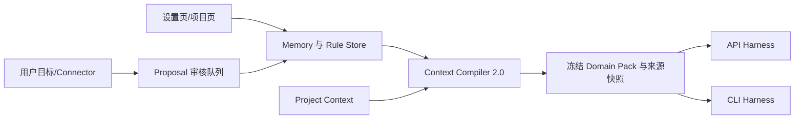

# 技术设计

## 架构概览

## 数据模型

`MemoryEntry` 与 `GlobalRule` 采用统一来源字段：`id`、`name`、`description`、`type`、`scope`、`source`、`confirmed`、`enabled`、`version`、`content_hash`、`created_at`、`updated_at`。Memory 类型首批固定为 `profile`、`fact`、`preference`、`project`、`reference`、`rule`、`feedback`。

存储采用可审查的 Markdown 条目加索引；设置开关单独保存。所有进入 Run 的条目必须生成不可变快照，删除或修改不会改变历史 Run。

## Context Compiler 2.0

编译顺序固定为：代码硬策略 → 系统安全与隐私边界 → Capability/Permission Gate → Tool Contract → PHOTO_EDITING 契约 → 已确认全局规则与 Memory → Project Context → StyleProfile → 当前目标 → Skill → Template → Reference。Tool Contract 是后端生成的 Domain Pack 安全边界，任何 Memory、Skill、Template、Connector 或 MCP 内容都不能新增工具、扩大能力或覆盖它。当前目标只能覆盖普通偏好，不能覆盖安全边界。

编译结果新增 `source_snapshots`、`used_memory_ids`、`used_rule_ids`、`omitted_sources`、`omission_reasons`、`content_hash` 和 Token 估计。所有结构化用户内容进入独立分区并转义边界字符。

## API 与 UI

- `GET/PATCH /api/memory/config`：启用状态、自动提取、模型提取配置。
- `GET /api/memory/tree`、`GET/PUT/DELETE /api/memory/:id`：条目管理。
- `POST /api/proposals`、`POST /api/proposals/:id/{confirm,reject,apply}`：跨 Memory、ProjectContext、Skill、Template 和 Reference 的统一提案生命周期。
- `GET/PUT /api/rules`：全局规则管理。
- 设置页增加“全局规则”“记忆树”“自动提取与隐私”三个分区。
- Run 详情增加“本次上下文”面板，显示来源、版本、Hash、冲突和省略原因。

## 测试策略

离线测试覆盖规则优先级、Proposal 确认、Memory 删除后的新旧 Run 隔离、路径/密钥脱敏、预算省略、Hash 稳定性和 Prompt 分区。不得在测试中读取真实用户目录或调用真实 Provider。

## 安全考虑

系统规则与用户规则分层；模型不能直接写正式 Memory；Entry ID 只允许安全 slug；外部来源默认不可信；日志只记录来源 ID 和 Hash，不记录密钥、原图路径、EXIF 或完整记忆正文。

## 跨模块契约与现状边界

| 项目 | 当前已有能力 | 本 Spec 补齐内容 | 验收证据 |
|---|---|---|---|
| 上下文快照 | Agent 运行已有上下文输入 | Compiler 2.0 的优先级、来源 Hash 与省略原因 | 编译器契约测试 |
| 提案写入 | Memory 有独立提案接口 | 统一 Proposal 状态机与 provenance | Proposal API/审计测试 |
| 工具边界 | Runtime 有工具白名单 | 编译前固定 Tool Contract，禁止内容覆盖 | 越权内容离线测试 |
