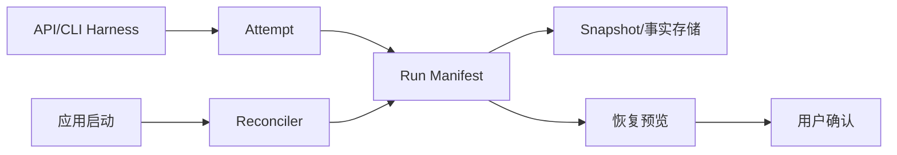

# 技术设计

## 架构概览

Run Manifest 是规范化状态源，Attempt 是一次实际 Harness 执行。持久化层保存追加事实与快照；启动 Reconciler 负责收敛；Resume Service 只创建新 Attempt。Manifest 负责运行事实，不取代既有 `session_store`：后者保存会话索引和 UI 查询状态，Manifest 保存可审计的运行 ABI，二者通过 run_id 关联。

## 数据模型

Manifest 包含 runId、attempts、photoHash、baselineHash、domainPackHash、globalRulesHash、memorySnapshot、projectContextSnapshot、skill/template 版本、harness/provider/model、candidate revisions、tool facts、stop/failure reason、confirmation 和 native session handle。每个事实带序号、幂等 event_id、时间、摘要和 schema 版本。追加记录采用事务写入并在提交点 fsync；Manifest 快照与最后一条事实通过同一事务或临时文件替换原子发布。

## 接口与状态

- `ManifestStore.create/append/load`
- `Reconciler.reconcile()`：收敛运行状态并检测 stale
- `ResumeService.startAttempt(runId, harness)`：复制最后规范化上下文，禁止复用旧收费调用
- `ManifestService.markStale(runId, reason)`

状态包括 `starting`、`running`、`cancelling`、`interrupted`、`stale`、`completed`、`failed`；应用确认是唯一正式提交入口。

## 测试策略

使用临时目录和 Fake Harness 做崩溃恢复、重启收敛、API/CLI 切换、基线变化、幂等追加、损坏尾记录和晚到隔离测试。恢复先校验完整事实和 Hash，再截断不可解析尾记录，按 sequence 重放；重复 event_id 幂等丢弃，未完成 Attempt 不自动继续。测试禁止网络和真实 Provider。

## 安全考虑

Manifest 只保存路径标识和 Hash，不保存原图或密钥；敏感字段加密或引用安全存储。恢复前重新校验权限、Skill Hash、规则快照和正式基线，防止旧运行越权。

## 与现有模块边界

复用 Runtime Registry、AgentAdapter、CandidateRuntime 和 User Review Gate；Run Manifest 不改变模型工具白名单，也不允许绕过候选确认。

## 跨模块契约与现状边界

| 项目 | 当前已有能力 | 本 Spec 补齐内容 | 验收证据 |
|---|---|---|---|
| 运行事件 | AgentEvent 已有 run/attempt/sequence | 追加事实、幂等键和 schema 迁移 | 事件回放测试 |
| 运行状态 | InMemoryRunAuthority 提供内存状态 | 持久化、启动收敛和崩溃恢复 | 临时目录恢复测试 |
| 候选恢复 | CandidateRuntime 有不可变 Revision | 恢复仅到预览，基线变化标记 stale | stale/确认门测试 |
