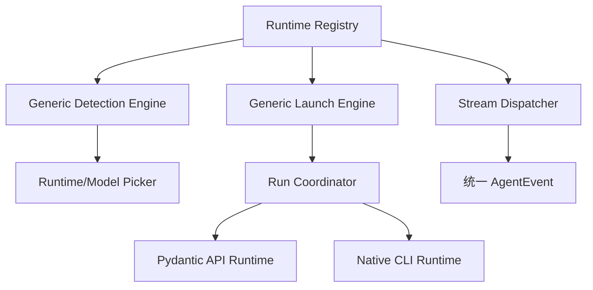

# 技术设计

## 架构概览

## Runtime Definition

统一定义包含 `runtime_id`、`kind`、`probe`、`auth_probe`、`model_discovery`、`invocation`、`input_transport`、`stream_format`、`capabilities`、`resume`、`mcp` 和 `permission_profile`。定义字段只能是数据或纯参数构造器，不允许在定义中实现 Agent Loop。

通用引擎负责探测、启动、事件解析、取消、超时、回收和错误脱敏。已有 Pi、Pydantic API 和 Fake Runtime 迁移到同一注册表；新的 wire format 才新增独立 parser。

## API 与事件

- `GET /api/runtimes`：返回可用 Runtime、版本、认证、模型和能力。
- `POST /api/runtimes/detect`：触发隔离的并行探测。
- `AgentEvent` 保持现有八类事件并增加 Runtime 能力快照和 session handle 元数据。
- 运行输入继续只包含编译 Domain Pack、脱敏代理图、模型和 Attempt 身份，禁止把路径和密钥放入模型参数。

## 测试策略

使用 Fake CLI/Provider 固定探测、模型发现、事件顺序、取消、超时、Resume、非法能力组合和进程回收。真实 CLI 只进入可选人工集成测试。

## 安全考虑

Runtime Definition 不能授予额外权限；权限由独立 Permission Profile 和 Scoped Gateway 决定。探测日志不得记录完整环境和密钥。Windows 命令行长度、`.cmd` 外壳和实际子进程必须分别验证。
