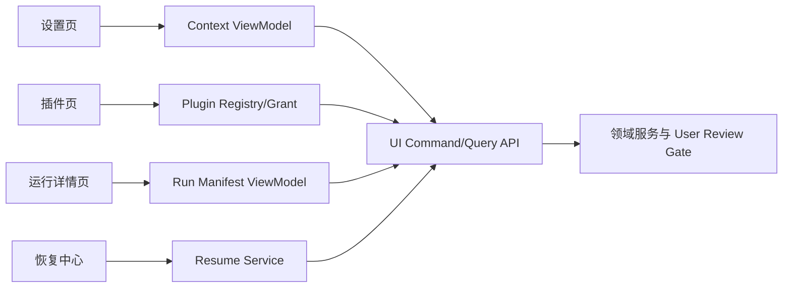

# 技术设计

## 架构概览

UI 只负责展示状态、发起用户意图和收集确认；所有规则、权限、运行和候选校验由后端领域模块执行。界面通过只读 ViewModel 与命令 API 通信，避免复制业务逻辑。

## 页面与数据模型

### 设置页

分为“全局规则”“记忆”“项目上下文”三个面板。每项显示类型、正文摘要、来源、确认状态、Hash、更新时间和编辑/停用操作；Proposal 使用左右差异视图并提供确认、拒绝、延后。

### 插件页

包含官方/社区/本地来源筛选、安装状态、版本历史、Manifest 详情和 Capability Grant 对话框。能力按文件、网络、Provider、Connector、候选写入等类别分组，默认全部拒绝。

### 运行详情页

以时间线展示 Attempt 和规范化 AgentEvent；侧栏展示上下文/Skill/Template 快照，候选卡片展示预览、参数 Patch、指标、VerifierResult、Critique 和“应用到正式版本”确认按钮。

### 恢复中心

列出 `interrupted`、`stale`、`failed` 运行，提供最后一致事实、基线 Hash 对比、原生 Resume 信息和“新建 Attempt”“仅查看候选”“放弃运行”操作。

## API 与状态

- 查询：`getContextView`、`listPlugins`、`getRunDetails`、`listRecoverableRuns`
- 命令：`updateRule`、`reviewProposal`、`grantCapability`、`revokeCapability`、`startAttempt`、`confirmCandidate`
- UI 状态通过事件订阅更新；命令必须携带用户确认 token，服务端再次校验权限和基线。

## 测试策略

测试重点是状态转换和权限边界：Proposal 确认、插件授权撤销、候选确认、取消、stale 恢复、晚到事件和页面刷新后的幂等。视觉布局通过渲染检查，逻辑使用离线 API/组件测试；不调用真实 Provider。

## 安全与隐私

UI 不接触原图路径和密钥明文，仅显示脱敏标签与摘要。危险操作采用二次确认和明确接收方提示；任何 UI 命令都不能绕过 User Review Gate、Capability Gate 或 Run Manifest 校验。

## 与现有模块边界

复用 Context Compiler、Plugin Registry、Runtime Registry、Run Manifest、Verifier/Critique 和 CandidateRuntime；本 Spec 不新增业务规则，不改变 API/CLI Harness 契约。
