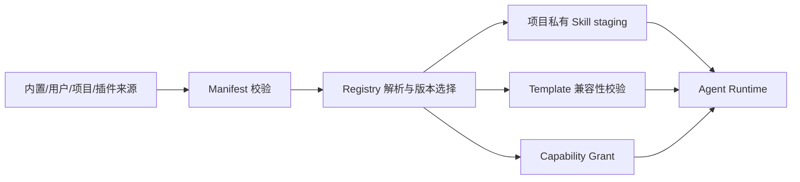

# 技术设计

## 架构概览

扩展分为声明层（Manifest）、内容层（Skill/Template）、能力层（Plugin Capability）和注册层（Registry）。运行时只消费经过校验、冻结的只读快照。

## 清单与数据模型

Plugin Manifest 至少包含 `specVersion`、`name`、`version`、`kind`、`taskKind`、`mode`、`inputs`、`capabilities`；`kind` 与 `mode` 使用白名单枚举。Skill 记录 `id/version/source/hash/references`，Template 记录 `id/version/compatibleSkills/patch/risk`。Registry 保存来源、摘要、安装时间、依赖和撤销状态。

Capability 使用统一命名空间（如 `provider.proxy_image`、`connector.read_catalog`、`workspace.read_metadata`），Grant 绑定主体（插件）、项目、版本 Hash 和作用域（Run/Attempt/单次调用），可设置过期时间。Runtime `permission_profile` 只能收窄 Grant；Capability Gate、Tool Contract 和运行时权限取交集，任何冲突按拒绝处理。撤销后立即使未完成的 Scoped Token/Lease 失效。

## 接口与数据流

- `Registry.list(kind, filters)`：只读列出可用扩展。
- `Registry.resolve(id, version)`：解析确定版本并返回不可变快照。
- `Stager.stage(skillSnapshot, projectId)`：复制 Skill 与白名单 Reference，返回 staging 路径和摘要。
- `CapabilityGate.request(manifest, scope)`：生成用户可审阅的最小授权请求。
- `Installer.install/upgrade/uninstall(package)`：校验后写入注册表，旧版本保留。

Skill 不能通过清单增加工具权限；Template 不包含执行代码。插件与 Runtime 通过窄接口交换结构化数据，不得直接修改正式参数或文件。

## 测试策略

离线契约测试覆盖清单解析、来源优先级、Hash 冻结、模板 Patch、能力拒绝、升级回滚和历史 staging。Fake Plugin Conformance Suite 验证所有插件在无网络、无真实照片环境下的生命周期。

## 安全考虑

包路径防遍历，依赖固定摘要；发布包使用受信任根签名，支持密钥轮换和撤销列表；本地开发插件必须显式标记为未签名并单独授权。插件默认无文件、Shell、网络和原图权限。外部输入仅能生成候选 Proposal，须经用户确认才可写入项目配置。审计日志记录授权、撤销、拒绝和版本。

## 与现有模块边界

复用现有 `AgentTemplate`、参数契约、`CandidateRuntime` 和 Reference 白名单加载器；本 Spec 只定义注册、来源和权限，不复制渲染、Patch 计算或 Agent Loop。

## 跨模块契约与现状边界

| 项目 | 当前已有能力 | 本 Spec 补齐内容 | 验收证据 |
|---|---|---|---|
| Skill/Template | 已有内置 Skill 与白盒模板 | 多来源 Registry、staging 与版本冻结 | Registry 契约测试 |
| 权限 | Runtime 有权限配置 | Capability/Grant/Scoped Token 单一真相源 | 权限交集与撤销测试 |
| 扩展供应链 | 本地内容可加载 | 签名根、轮换、撤销和本地例外 | Fake 包校验测试 |
