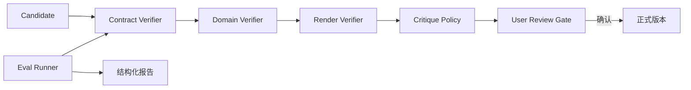

# 技术设计

## 架构概览

Verifier 是纯函数式门禁层，Critique 生成面向人的解释，Eval Runner 驱动统一 AgentAdapter 与 CandidateRuntime。四层验证互不绕过。CandidateRuntime 仍是参数校验、渲染和 Revision 的唯一实现；Contract Verifier 只调用其公开契约并规范化结果，Render Verifier 消费 CandidateRuntime 已生成的预览与指标，除明确的二次诊断场景外不重复渲染。

## 数据模型与接口

`VerifierResult` 包含 `status`（pass/warn/fail）、`violations`、`metrics`、`evidenceHash` 和 `failureClass`。硬失败不得进入 User Review Gate；软警告可以展示但不能自动提交。验证器接口为 `verify(candidate, context) -> VerifierResult`。Verifier 失败不创建新的 Candidate Revision；只有 CandidateRuntime 接受并冻结的候选才有 Revision。`CritiquePolicy` 声明维度、阈值、解释模板和能力不足行为，即使自动验证失败也可以生成解释性结果，但不得改变候选。

Eval Case 固定代理图、初始分析、目标、Skill/Template、Fake Harness 事件脚本、允许终态和硬不变量。报告包含阶段、配置、轨迹、候选/正式版本 Hash、隐私检查及待人工字段。

## 数据流

候选先经 Contract，再经领域约束和渲染指标检查；通过后生成 Critique 与预览，最后等待用户确认。Eval Runner 可切换“仅领域契约/契约+Skill”“无/匹配/不匹配 Template”“图片+指标/仅渲染成功”消融。

## 测试策略

先跑方向性契约测试，再跑 20 个离线场景和安全场景；真实模型消融使用同一报告格式，人工 Pairwise 记录独立存档。任何测试不得触网或调用真实 Provider。

## 安全考虑

Verifier 不接受任意 Prompt 作为规则，不读取真实用户目录；指标和证据使用脱敏摘要。User Review Gate 是正式版本唯一入口，失败或取消不得产生隐式提交。

## 与现有模块边界

复用参数契约、CandidateRuntime、AgentAdapter 和既有离线 Eval 数据；本 Spec 把检查编排抽出，不改变 Runtime 的候选不可变 Revision 语义。

## 跨模块契约与现状边界

| 项目 | 当前已有能力 | 本 Spec 补齐内容 | 验收证据 |
|---|---|---|---|
| 参数与渲染 | CandidateRuntime 负责校验、渲染、指标和 Revision | Verifier 结果规范化及硬/软语义 | Verifier 契约测试 |
| 领域诊断 | Skill 可声明适用和禁用条件 | Critique policy 与能力不足解释 | Skill 诊断测试 |
| 评测 | 已有离线 Fake 场景 | 分层报告、消融配置与人工待办字段 | Eval Runner 报告测试 |
