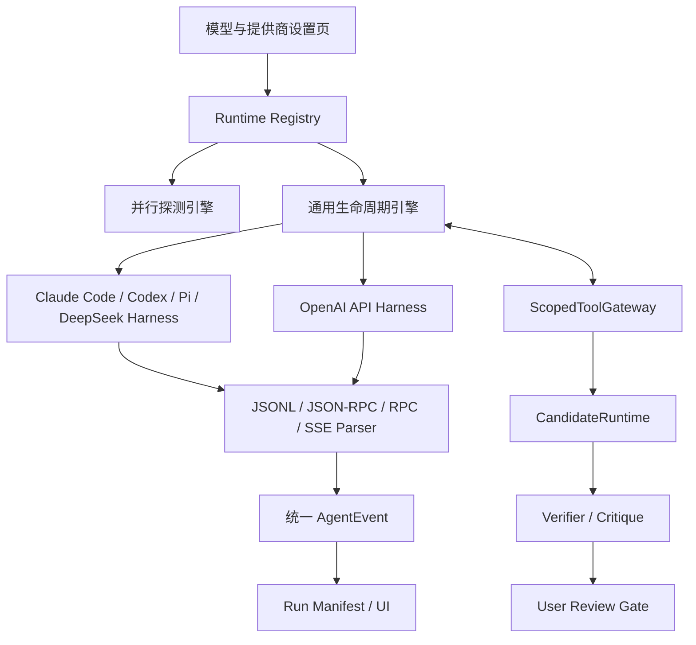

# 技术设计

## 架构概览

本阶段采用“声明式 Runtime Definition + 通用生命周期引擎 + 协议解析器”结构。Runtime Definition 只描述入口和能力，不实现 Agent Loop；生命周期、探测、启动、取消、恢复和错误脱敏由通用引擎负责。LookLift 的领域 Workflow 和 CandidateRuntime 位于 Runtime 之上，继续拥有白盒参数和正式版本的唯一写入边界。



## 与既有规格关系

- `260825-runtime-registry` 继续拥有 Runtime Registry 基础契约；本规格只扩展 Harness、Provider 和迁移。
- `260825-settings-plugin-run-ui` 继续拥有设置页基础 ViewModel；本规格补充模型/提供商双模式字段与交互。
- 已实现的 `RuntimeLifecycleEngine` 只做扩展和兼容迁移，不重复抽取第二套引擎。
- 共享 Capability/Grant/Permission Profile 继续由 `260825-skill-template-plugin` 的基础契约拥有，Proposal 生命周期继续由 `260825-context-memory-global-rules` 拥有；本规格只引用，不重新定义。

## 技术栈与选型

- Runtime Registry：复用现有 Python Registry，Definition 使用不可变数据模型和白名单枚举。
- CLI 进程：复用现有 `CliAgentAdapter`、Pi RPC 和 CLI Workspace 能力，按 Definition 选择启动参数和 Stream Parser。
- API Harness：使用标准 HTTP 传输、OpenAI 协议请求构造器和 SSE/JSON 解析器；不再把 Pydantic-AI 作为 Harness 生命周期依赖。
- 事件：继续使用统一 `AgentEvent`，保留 `run_id`、`attempt_id`、`sequence`、事件类型和脱敏 Payload。
- 候选执行：复用 `CandidateRuntime`、参数契约、Verifier、Run Manifest 和 User Review Gate，不复制 Patch 校验或渲染实现。
- 设置页：复用现有 React/TypeScript 平台壳、API Client 和主题 Token；交互结构采用模型/提供商双模式页面。

替换 Pydantic-AI 专属 Loop 的原因是让 Provider 协议、流解析、取消和错误分类服从同一声明式 Runtime 契约，避免框架内部 Agent Loop 与 LookLift 通用生命周期形成第二套状态语义。迁移不是直接删除既有能力：OpenAI-compatible 必须先通过请求、图片、Tool Call、SSE、取消和错误分类等价门；Ollama 必须通过受控 loopback 与无密钥门；Anthropic 在本规格中不新增直连实现，迁移期间继续由旧兼容 Adapter 承载。只有后续直连 Definition 通过同等级门禁，或产品需求明确移除 Anthropic 后，才允许删除最后的 Pydantic-AI 兼容依赖。

## Runtime Definition 契约

每个 Definition 至少声明：`runtime_id`、`kind`、`display_name`、`executable` 或 `endpoint`、版本探测、模型探测、输入传输、流格式、事件解析器、能力集合、权限 Profile、MCP、取消、超时和 Resume 支持。

首批 Runtime：

| Runtime | 类型 | 运行方式 | 事件来源 |
|---|---|---|---|
| Claude Code | CLI | 启动本机 `claude`，按其结构化输出协议通信 | Stream Parser |
| Codex | CLI | 启动本机 `codex`，通过 JSON 事件流通信 | JSON Event Parser |
| Pi | CLI | 启动本机 Pi RPC，传递图片和工具结果 | Pi RPC Parser |
| DeepSeek Harness | CLI | 启动本机 `dsh`，使用其 JSONL 事件协议 | DeepSeek Parser |
| OpenAI API | API | 直接请求用户配置的 OpenAI 或兼容 Base URL | SSE / JSON Parser |

Runtime Registry 负责唯一 ID、来源、版本和撤销状态；Detection Engine 并行执行可执行文件、版本、认证和模型探测，单个 Runtime 失败不阻断其他条目。未知 Runtime、缺少能力或 Definition 与 Permission Profile 冲突时，启动前拒绝。

## Harness 与 Workflow 边界

Harness 只负责“把某一种模型入口接进系统”：

- CLI Harness 负责子进程、隔离环境、Workspace、stdin/stdout、JSONL/RPC 以及进程回收。
- API Harness 负责 Provider 协议、请求构造、SSE/JSON 解码、工具调用循环、超时和连接错误分类。
- Stream Parser 负责把不同上游事件转换为统一 `AgentEvent`。
- Workflow 负责系统级上下文、候选状态和终态语义；模型轮次、思考、观察及工具调用顺序由 Harness 自主负责，系统不规定固定 Agent Loop。
- CandidateRuntime 负责参数校验、渲染、指标、Revision 和晚到隔离。

API 和 CLI 可以拥有不同的传输方式，但不得拥有两套候选执行逻辑。`render_candidate` 和 `finish_candidate` 都必须经过同一 `ScopedToolGateway` 与 CandidateRuntime；只有产生成功候选且终态为 `candidate_ready` 时，候选才冻结并进入 Verifier。`no_change_needed`、`insufficient_capability` 等无候选终态只记录结构化结果，不进入 Candidate Verifier 或 User Review Gate。

## OpenAI API Harness

API 配置使用 Provider 快照：`provider_id`、`base_url`、`model`、`api_key_ref`、`protocol`、`max_tokens` 和配置版本。OpenAI/OpenAI-compatible Provider 可要求 API Key；本地 Ollama 使用 OpenAI-compatible `/v1` 或其原生协议，明确选择后不要求 API Key，设置页隐藏该字段。Key 只通过安全存储引用传入请求构造器；日志、Run Manifest 和前端 Query 只记录 Provider、模型、接收方和配置 Hash。

OpenAI API Harness 支持：

1. OpenAI Chat Completions/Responses 兼容请求；
2. 无 EXIF 代理图输入；
3. 结构化工具定义和工具结果回传；
4. SSE 增量文本、工具调用和终态解析；
5. 用户明确触发的取消、超时和重试；
6. Provider 不可用时返回分类错误，不自动跨 Provider 降级。

## 设置页设计

设置页分成两层：

```text
模型与提供商
├── 本机 CLI
│   ├── 已检测 Runtime 卡片
│   ├── 模型和认证状态
│   ├── 能力标签
│   └── 重新扫描/安装提示
└── API 提供商
    ├── Provider 胶囊选择
    ├── API Key / Base URL / Model 表单
    ├── 连通性检测
    └── 本地存储与接收方提示
```

视觉实现目标是以已确认的参考截图为基准进行像素级对齐：顶部双模式分段控件、Provider 胶囊列表、卡片式配置区域、字体层级、间距、状态提示、模型下拉和检测反馈均纳入截图对比；使用 LookLift 自有 Token、组件和文案实现相同布局与交互结果。

固定状态基准：`references/provider-settings-cli.jpg` 与 `references/provider-settings-api.jpg`，两张均为 `1264×861`、DPR 1、桌面浅色界面，分别对应“本机 CLI”和“API 提供商”。验收采用人工浏览器截图对比，不复制外部源码、图标或资源。参考图未提供窄屏和深色版本，因此 `390×844` 窄屏与深色主题只按 LookLift 自有 Token 人工验证响应式重排、内容可读性、控件可操作性和主题对比度，不声称像素级参考图对齐。

设置页 ViewModel 必须带 `contract_version`，Query 不返回密钥正文、可执行文件完整路径、环境变量或本地数据库路径。Command 接口需要区分保存、检测、删除和选择 Runtime，保存失败不能改变当前生效配置。

## 测试策略

- Definition 契约测试：五个 Runtime 的唯一 ID、字段、能力、流格式和不可用状态。
- Parser 测试：使用录制/构造的 Fake CLI 和 Fake API 事件，验证正常、工具调用、错误、取消、超时、晚到和终态。
- Workflow 测试：不同 Harness 进入同一 CandidateRuntime 后，候选 Revision、Verifier 和正式版本不变量一致。
- 安全测试：API Key、路径、EXIF、Prompt 注入、未授权工具、跨 Provider 降级和 Workspace 隔离。
- UI 测试：Provider 切换、表单隔离、密钥不回显、检测失败、取消和刷新；视觉验收通过参考截图和人工浏览器检查完成。
- 运行测试全部离线，禁止真实 Provider、真实 CLI 和网络请求进入默认 CI。

## 安全考虑

- Capability Gate、Permission Profile 和 Tool Contract 的交集是最终权限，Runtime Definition 不能扩大权限。
- API Key 只保存安全引用；错误和遥测只输出脱敏 Provider/Model/配置 Hash。
- 外发图片必须是 2048px 以内、无 EXIF 的代理图；禁止原图路径和数据库路径进入模型上下文。
- API/CLI 的取消、超时和晚到结果必须撤销令牌并隔离，不得写入正式版本。
- Provider Base URL 执行 HTTPS、DNS 解析后 IP 校验、私网/loopback/link-local/CGNAT 拒绝、默认禁止重定向及响应/解压大小限制。凭据由 Python sidecar 的安全存储适配器持有；不可用时拒绝保存。API Key 不进入前端 Query、模型上下文、普通日志或 Run Manifest。Ollama loopback 仅在用户明确选择本地 Provider 时例外，且请求不得经外部代理。

## 支持等级

| Runtime | 初始等级 |
|---|---|
| Pi | 正式 |
| Claude Code | 实验性 |
| Codex | 实验性 |
| DeepSeek Harness | 实验性 |
| OpenAI API | 实验性，完成 API 与安全门禁后升级 |

## 迁移与兼容

迁移分为五步：

1. 更新既有 Runtime/UI 规格的归属与迁移说明；
2. 抽取现有 API Adapter 和 CLI Adapter 的共同事件、生命周期和错误分类；
3. 将五类 Runtime 注册为 Definition，并按支持等级管理；
4. 迁移 OpenAI API Harness；OpenAI-compatible 与 Ollama 通过等价门后切换到新实现，Anthropic 在直连 Definition 或明确产品决策完成前保留旧兼容 Adapter；
5. 兼容旧 Adapter 与 Manifest，禁止重复维护候选校验逻辑。

旧 Run Manifest、候选 Revision 和前端 ViewModel 必须向后兼容；旧 API Adapter 迁移期间可以通过兼容工厂运行，但不得同时维护两套候选校验逻辑。

## 当前能力 → 本 Spec 补齐 → 验收证据

| 项目 | 当前能力 | 本 Spec 补齐 | 验收证据 |
|---|---|---|---|
| CLI Runtime | 已有 API/CLI Adapter、Pi 和 Runtime Registry | 统一 Definition、通用生命周期和五 Runtime 目录 | Runtime/Parser Conformance 测试 |
| API 调用 | 已有 Pydantic-AI API Adapter | 独立 OpenAI API Harness、SSE/Tool Call 循环 | Fake API 事件测试 |
| 候选安全 | CandidateRuntime、Verifier 已实现 | 让所有新 Harness 强制复用同一候选闭环 | 跨 Harness 不变量测试 |
| 设置页 | 已有 Provider/Runtime 基础页面 | 双模式、Provider 表单、检测和视觉对齐 | UI 交互测试与人工截图验收 |
