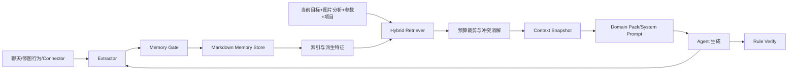

# 技术设计

## 架构概览



## 自动写入策略

Agent、LLM 和 Connector 可以直接写入并激活正式 Memory，采用 OpenDesign 式 auto-keep；不设置逐条用户确认为主流程。写入前统一经过 `MemoryGate`：持久性判断、作用域判定、敏感信息扫描、类型校验、重复检测和冲突处理。既有 Proposal 保留为高风险变更、人工编辑、冲突解决和审计对象，但不再是自动 Memory 生效的必经闸门。

低风险稳定偏好、明确“记住”命令和高置信度用户事实可自动写入。单次操作、短期状态和一次性反馈只能进入 `run` 或事件缓冲。跨多次 Run 聚合后才可升级为 global。规则自动写入时默认限制到当前项目或 artifact 类型；全局规则需达到重复证据阈值后才升级。

每条自动写入保留 `source`、`source_event_id`、`confidence`、`evidence`、`created_at` 和 `updated_at`。设置页提供记忆树、最近自动写入、撤销、编辑、停用、删除和总开关；自然语言“忘掉刚才记住的内容”调用同一删除服务。

## 数据与索引

主数据继续采用受限 Markdown 条目、`index.json` 和 `config.json`，沿用 `ContextEntry` 的 `version`、`enabled`、`scope` 与 `content_hash`，并新增 `state`、`project_id`、`run_id`、`expires_at`、`source_event_id`、`confidence` 和 `evidence`。移除 `confirmed` 字段及其所有激活语义；`state=active` 即可参与新 Run，`disabled/deleted` 不得参与。旧数据迁移时，`confirmed=true && enabled=true` 映射为 `active`，其余映射为 `disabled`，迁移结果记录 schema 版本。

新增派生索引文件（可重建，不作为主数据）：

- `features.json`：规范化文本、标签、主题组、重要度、置信度、使用统计和更新时间；
- `bm25` 索引：首选 SQLite FTS5；中文采用分词与字符 n-gram 的组合；
- `embeddings`：使用 FastEmbed + ONNX Runtime 加载 `BAAI/bge-small-zh-v1.5` 本地中文向量模型；向量按条目内容 Hash 增量更新并持久化缓存，模型缺失或加载失败时自动降级到 BM25。

embedding 不发送原始路径、EXIF、密钥或未脱敏内容到外部 provider。无 embedding 模型时系统降级为 BM25，不影响主流程。

`project` 条目必须带非空 `project_id`；`run` 条目必须带非空 `run_id` 和 `expires_at`。run 条目写入独立 ephemeral 区或使用强制过期过滤，Run 结束后保留事件和快照但不再进入长期索引。

## Recall Query

Recall Query 由以下部分组成并带字段标记：当前用户目标、图片分析摘要、编辑参数路径和值、当前 `project_id` 与项目目标、最近用户反馈、artifact 类型。查询构造不改变用户原文，只生成检索用的规范化文本和领域标签。

## 混合召回算法

1. 先做硬过滤：`state=active`、作用域、项目/Run 匹配、有效期和冲突淘汰。
2. BM25 召回 Top 20；字段权重固定为 `name/tags=4、description=2、content=1、evidence=0.5`。
3. 向量索引召回 Top 20；使用条目的短 `searchable_text`，而不是整份 Markdown。
4. 使用固定 `RRF k=60` 融合两个排名；相同 RRF 分数按 scope 优先级、confidence、updated_at、entry_id 顺序稳定排序。
5. 对融合 Top 20 做主题去重、冲突组处理和来源多样性控制；后续可插入轻量 reranker，首版不强制依赖。
6. 固定分区预算：profile 1,500、project 1,000、preference/feedback 1,500、reference 500、rule 1,500 tokens，总预算上限 6,000 tokens。超限时按 `reference → feedback → preference → project → profile` 顺序省略；适用 rule 超限则返回编译失败/需扩容诊断，不得静默截断。

`profile` 在固定小预算内优先注入；当前项目条目优先于 global；适用规则走独立通道并进入 Verify。每次召回返回 `used`、`omitted`、排名、检索来源（BM25/vector/both）和裁剪原因。

## 优先级与冲突

安全与工具契约 > 当前用户明确目标 > run > project > global。软偏好不能覆盖安全边界。相同 `conflict_group` 中按作用域、明确用户指令、重复证据、置信度和更新时间择优；冲突未能自动解决时，保留一条主条目并在快照中记录冲突，不把两条相反建议同时注入。

## Rule 契约

`rule` 条目必须包含 `assertion`、`check`、可选 `artifact_types` 和 `conflict_group`。`artifact_types` 为空表示适用于所有产物；非空时只有匹配当前产物类型才加载。适用 rule 走独立预算并必须进入 Verify，验证结果包含 rule_id、版本、status、note 和 skip_reason。

## 撤销、删除与审计

服务接口统一定义为：`GET /api/memory`、`POST /api/memory/auto`、`PATCH /api/memory/:id`、`POST /api/memory/:id/disable`、`POST /api/memory/:id/revert`、`DELETE /api/memory/:id`、`GET /api/memory/events`。写入和变更携带幂等 `event_id` 与 `base_hash`；版本冲突不得覆盖最新内容。撤销针对具体 `entry_id + version` 或 `source_event_id`，对新 Run 生效，对已冻结快照无影响。

## Context Snapshot

Run 开始时冻结 `used_memory_ids`、`used_rule_ids`、条目版本、Hash、排名和省略原因，写入 Domain Pack/Run Manifest。后续 Memory 修改不影响已开始的 Run。

## 运行后闭环

Agent 子进程结束后异步执行普通聊天提取和标注/修图行为聚合；失败不阻塞交付。存在适用 rule 且产出 artifact 时执行 scorecard 验证。成功写入、跳过、失败、验证和撤销事件进入 ring buffer/事件日志，供设置页和运行详情查看。

## 安全与降级

所有外部来源默认不可信；Memory 不能扩大 Tool Contract、权限或安全边界。检索服务不可用时按 `profile → project → rule → 普通 BM25` 顺序降级；embedding 不可用只禁用向量分支。预算不足不得截断安全边界、当前目标和适用规则。

## 测试策略

离线测试覆盖 Memory Gate 分类、敏感信息拒绝、作用域降级、重复/冲突合并、BM25 分词、向量缺失降级、RRF 稳定性、主题去重、预算裁剪、规则完整性、快照不可变性、撤销和来源审计。使用固定 embedding fixture，禁止测试触网或调用真实 provider。

## 评测设计

### 评测数据集

建立固定的中文摄影/修图案例集。每个案例包含历史对话或行为事件、当前目标、图片分析摘要、编辑参数、可选 `project_id`，以及人工标注的 `gold_memory`、`must_not_write`、`must_recall` 和 `must_not_recall`。数据必须覆盖全局偏好、项目偏好、Run 临时要求、明确记忆命令、重复行为、同义表达、冲突、过期、敏感内容、无相关记忆和 10/50/200/500 条记忆规模。

### 写入指标

- `Write Precision`：自动写入且有长期价值的条目 / 自动写入总数；
- `Write Recall`：成功提取的 gold 条目 / gold 条目总数；
- `Scope Accuracy`：global/project/run 判断正确的条目比例；
- `Overgeneralization Rate`：把单次或项目行为错误升级为全局的比例；
- `Conflict Resolution Accuracy`：冲突是否被正确合并、覆盖或隔离；
- `Sensitive Block Rate`：密钥、路径、EXIF 等候选被阻止或脱敏的比例；
- `Undo Success Rate` 与 `Mean Time To Forget`：撤销准确率和错误记忆平均存活时间。

### 召回指标

- `Recall@3/5/10` 与 `Precision@3/5/10`，按 profile、project、preference、feedback、reference、rule 分类型统计；
- `Noise Rate`：无关 Memory token / 注入 Memory 总 token；
- `Rule Coverage`：适用规则中实际注入并验证的比例，目标为 100%；
- `Scope Leakage`：其他项目或已结束 Run 的记忆被错误召回的比例；
- `Conflict Leakage`：相互冲突的条目被同时注入的比例；
- `Omission Explainability`：被省略条目是否都有结构化原因。

### 成本与性能指标

记录 Memory token、总输入 token、Memory Token Ratio、BM25/向量/RRF/快照耗时及 P50/P95 延迟，并比较 10、50、200、500 条 Memory 的增长曲线。Hybrid 的目标是让 Memory token 随库规模增长保持受预算控制，而不是线性增长。

### 基线与端到端对照

使用同一数据集、模型和上下文预算比较：

```text
A. 无 Memory
B. 全量 Memory
C. 纯 BM25
D. 纯向量
E. BM25 + 向量 + RRF（目标方案）
```

端到端指标包括首轮接受率、平均用户纠正次数、重复询问率、错误干扰率和白盒参数正确率。Hybrid 只有在显著降低 Memory token/成本且不降低关键记忆 Recall、Rule Coverage 和首轮任务质量时才算通过。

### 初始上线门槛

首版评测门槛为：自动写入 Precision ≥ 85%、敏感信息阻断率 = 100%、错误全局泛化率 ≤ 5%、关键 Memory Recall@5 ≥ 85%、普通 Memory Precision@5 ≥ 70%、适用 Rule Coverage = 100%、冲突泄漏率 = 0、Memory token 占总上下文 ≤ 8%、本地召回 P95 < 100ms、Hybrid 相对全量方案 Memory token 平均下降 ≥ 50%。统计口径固定为评测集 macro average；任一硬门槛失败即不通过。
