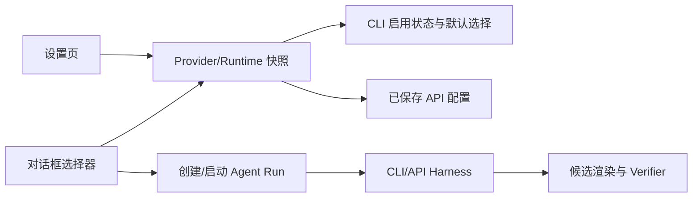
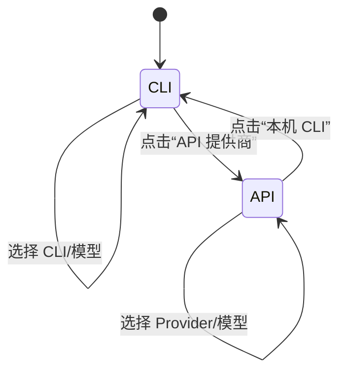
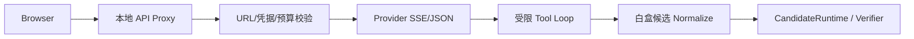
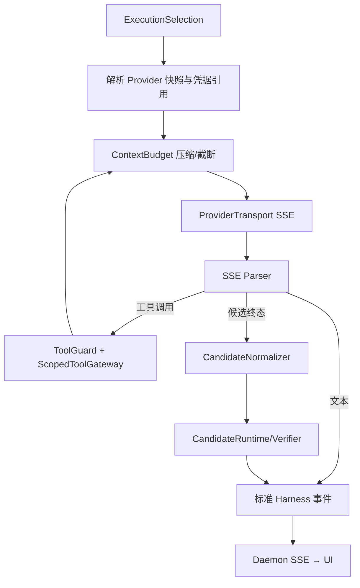

# 技术设计

## 架构概览

设置页继续作为展示与交互层，Runtime Registry 和 ProviderConfigStore 分别是 CLI 与 API 的唯一数据来源。新增的启停和默认选择通过本地设置状态持久化；对话框只读取同一份快照并提交 `runtime_id + model`，不复制 Provider 配置。

## 状态与数据契约

- `RuntimeSummary` 保留现有探测字段；界面层补充 `enabled`（默认 true）和默认标记，持久化键按 runtime ID 隔离。
- 默认选择由 `{runtime_id, model}` 组成；若默认入口被停用、删除或模型不再发现，读取时降级为空并要求用户重新选择，不自动猜测。
- API 配置继续使用 `ProviderSettings` 脱敏快照。编辑弹窗维护隔离草稿，提交调用现有保存接口；Key 仅以“已保存/未保存”呈现。
- 对话框选择器消费统一的 `SelectableModelSource` 视图模型，将 CLI 与 API 映射为相同的入口/模型层级；视图模型不持久化凭据。

## 交互流程

1. 设置页加载 Runtime 快照和 API 脱敏配置；CLI 模式按可用性、启用状态和默认状态排序。
2. CLI 行开关只更新本地启停状态；点击行打开模型弹窗，选择默认后刷新全局快照。
3. API 行点击打开编辑弹窗；保存成功后更新脱敏摘要和对话框可选项，取消/失败回滚草稿。
4. 对话框入口按钮打开两级选择器；提交前校验入口启用、可用、模型存在，随后将选择写入当前会话运行上下文。
5. 运行创建和启动沿用现有 Agent Run API；错误通过现有中文错误映射呈现。

## 安全与兼容

- 不新增网络探测路径；API URL、凭据、重定向和大小限制继续由现有 `provider_security` 与检测模块执行。
- 禁止 UI 直接调用 CLI 子进程或 Provider HTTP；所有执行必须经过 Runtime 生命周期与 ScopedToolGateway。
- 启停和默认状态变更不影响历史 Run Manifest；运行启动时冻结选择快照。
- 离线测试使用 fake Runtime、fake fetch 和临时配置目录，覆盖启停、默认失效、编辑取消、不可用阻止发送等边界。

## 视觉实现约束

沿用 LookLift Token 和现有设置页双栏布局：左侧导航对齐参考图层级，CLI/API 使用分段切换；CLI 与 API 条目采用单层卡片，模型列表和编辑表单使用弹窗。桌面浅色参考图仅用于本机 CLI/API 状态对齐，窄屏和深色按 Token 验收。

## OpenDesign 对齐的交互与运行模型

### 模式状态机

顶层分段按钮就是模式切换，不额外引入“启用 API”或“确认模式”状态。每个模式保存独立草稿和默认选择；运行开始时复制成不可变 `ExecutionSelection`。

### 输入框选择器

输入框按钮只展示当前 `ExecutionSelection` 的摘要。点击后按当前模式打开弹窗：

- CLI：入口列表 → 入口模型列表 → 选择并关闭；
- API：Provider 列表 → 已发现/已保存模型 → 选择并关闭；
- 弹窗底部统一提供“设置”，导航到设置页 `providers` 分区。

选择器不得直接修改全局配置；全局配置只由设置页保存。会话选择只影响后续请求，不重绑正在运行的 Attempt。

### BYOK API Loop 分层

没有本地 CLI 时，LookLift 采用与 OpenDesign 相同的“浏览器 → 本地 Daemon → Provider → SSE”拓扑，但领域输出不同：

- 传输层：Provider-specific 请求构造、SSE 解析、错误分类、取消和超时；不启动 CLI 进程。
- 工具层：允许列表、参数 Schema、路径范围和最大工具轮数；工具结果写回上下文前先压缩。
- 上下文层：按 `系统契约 > 当前照片事实 > 当前用户目标 > 最近工具结果 > 历史对话` 优先级保留；先摘要旧轮次，再对单条消息和工具结果做硬上限截断。每次压缩记录 `ContextCompactionEvent`（原始哈希、保留范围、摘要版本、丢弃字符/token 数）。
- 领域层：模型文本不能直接成为正式状态；必须解析为参数 Patch/Candidate，经范围校验、渲染、Verifier 和用户确认。

OpenDesign 的 `MAX_BYOK_TOOL_LOOPS`、消息截断和 artifact 摘要可作为实现参考；LookLift 需要额外冻结 token 预算、结构化候选协议和压缩事件，避免 HTML artifact 或黑盒输出越过白盒边界。

## 新增 Harness 设计：`ByokApiHarness`

### 责任边界

`ByokApiHarness` 是无 CLI 场景的本地 API 执行器，只负责一次 Attempt 的生命周期和事件编排；它不负责设置页状态、不直接修改正式版本，也不启动任何外部 CLI。现有 `OpenAiApiAdapter` 的 SSE 解析和工具授权逻辑可以抽取复用，但普通 `/api/chat/step` 不再自行拼接第二套工具循环。

### 核心接口契约

- `ByokApiHarness.start(input, cancel_token) -> AsyncIterator[HarnessEvent]`：启动且只允许一个 Attempt；事件序列单调递增。
- `ProviderTransport.stream(snapshot, request, api_key, cancel_token)`：仅负责上游 HTTP/SSE，不感知 LookLift 正式版本。
- `ToolGuard.call(token, name, arguments)`：先做允许列表、Schema、路径和大小校验，再调用 `ScopedToolGateway`；所有拒绝均返回稳定错误码。
- `ContextBudget.prepare(messages, budget) -> PreparedContext`：返回压缩后的消息和 `ContextCompactionEvent`，不覆盖本地原始会话记录。
- `CandidateNormalizer.normalize(tool_payload) -> CandidateDraft`：只接受白盒参数 Patch、解释、限制和证据字段。

### 状态机与终态

Attempt 状态为 `created → streaming → awaiting_tool → streaming → candidate_ready`，异常分支统一进入 `failed/cancelled/timeout`。`RUN_FINISHED`、`RUN_FAILED`、`RUN_CANCELLED` 三类终态互斥；终态之后忽略迟到的 Provider chunk 和重复取消。

### 事件与审计

事件至少包括 `RUN_STARTED`、`TEXT_DELTA`、`USAGE_UPDATED`、`TOOL_STARTED`、`TOOL_COMPLETED`、`CONTEXT_COMPACTION`、`CANDIDATE_CREATED`、`RUN_FINISHED`/`RUN_FAILED`。审计记录只保存 Attempt ID、Runtime/Provider ID、模型、工具名、参数摘要哈希、上下文压缩统计和错误码；禁止保存 API Key、完整工具参数中的敏感值及原始图片字节。

### 预算与截断默认契约

- 工具循环上限：基础 Harness 固定 3 轮，与 OpenDesign `MAX_BYOK_TOOL_LOOPS = 3` 对齐；单条普通消息：12,000 字符；单条工具结果：8,000 字符。
- 轮次定义为“一次 Provider 响应中产生工具调用并执行工具结果回写”的完整往返，而不是单个工具调用数；同一轮允许多个并行/连续工具调用，但总轮次仍只增加 1。达到第 3 轮后若仍未收到 `finish_candidate`/合法终态，发出 `tool_loop_limit` 失败并结束 Attempt。后续如确有复杂任务需求，只能通过新的版本化配置提高上限，不能由模型或用户请求动态突破基础上限。
- 上下文预算由 Harness 配置注入，默认达到预算的 80% 先压缩旧历史，达到 100% 再硬截断；系统契约和当前照片事实不得被截断。
- 工具结果优先保留 `ok/outcome/error/code/summary`，大字段替换为摘要和 SHA-256；截断不改变本地完整记录。

### 无 CLI 选择算法

当 `execution_mode=api` 时，先检查所选 Runtime 是否为 API 且启用，再检查本机 CLI 快照；CLI 快照为空并不是错误，而是选择 `ByokApiHarness` 的条件。只有 API 配置缺失、凭据解析失败或 Provider 不支持时才失败，不尝试 CLI fallback。

## 两项基础设施

### AgentRunInput 持久化与恢复

新增 `AgentRunInputCodec`，将运行所需的 `run_id`、`attempt_id`、`runtime_id`、模型、Domain Pack 指纹、代理图引用和 Provider 配置版本写入受保护的 Attempt 快照。快照只保存凭据引用和图片哈希，不保存 API Key 或原图；恢复时重新解析 Provider 凭据并校验基线哈希，任何字段不一致都以 `stale_attempt` 失败。

### Daemon 异步 SSE 出口

新增 `AsyncSseResponse` 与 `AttemptStreamManager`。HTTP 层将请求体解析、Attempt 注册、Lifecycle 事件迭代和取消拆开：stream 路由只消费一个异步迭代器并逐帧写出 SSE；cancel 路由调用同一 manager 的取消令牌。连接断开、超时或终态后必须释放 adapter、工具授权和队列，禁止把异步流收集成一个大 JSON 响应。

### 参考源码

- OpenDesign API Proxy：[`apps/daemon/src/routes/chat.ts`](https://github.com/nexu-io/open-design/blob/main/apps/daemon/src/routes/chat.ts)
- OpenDesign BYOK 工具：[`apps/daemon/src/byok-tools.ts`](https://github.com/nexu-io/open-design/blob/main/apps/daemon/src/byok-tools.ts)
- OpenDesign 前端 transcript 截断：[`apps/web/src/providers/daemon.ts`](https://github.com/nexu-io/open-design/blob/main/apps/web/src/providers/daemon.ts)
- OpenDesign Runtime 选择：[`apps/daemon/src/runtimes/defs/byok-opencode.ts`](https://github.com/nexu-io/open-design/blob/main/apps/daemon/src/runtimes/defs/byok-opencode.ts)
