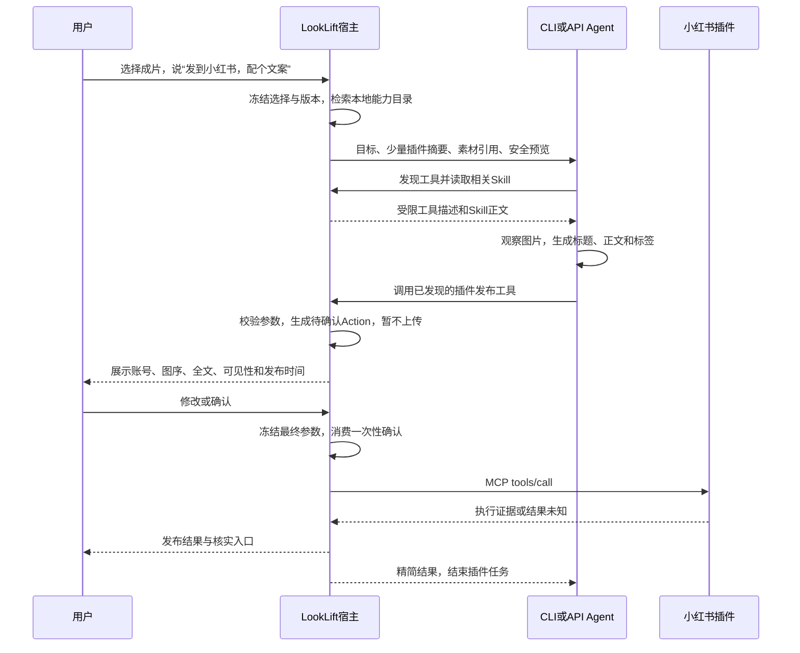

# 技术设计

> 状态：实施中。2026-09-12。配套：[需求](requirements.md)、[任务](tasks.md)。
> 完成条件：现状证据、模块所有权、渐进加载、多 Runtime、确认与分发契约无矛盾，一轮检查即停。

## 1. 核心决策

插件包含 Manifest、MCP 服务配置、可选适配代码、Skill 和参考资料。LookLift 统一承担安装、连接、检索、预算、素材交付和确认。平台专属代码归插件，新增兼容插件无需新增核心分支。

宿主知道全部工具，模型只看到当前任务需要的工具。采用“小集合直接暴露 + 大集合按需检索”的混合策略。API 优先动态注入完整 Schema；CLI 首版采用固定的通用发现/描述/调用桥接，经过兼容验证的 CLI 再使用动态原生工具投影。两条方式共用同一权限和执行入口。

Skill 指导 Agent 自主工作；真正上传与发布的确认由宿主强制执行。业务流程可以写在 Skill，安全规则不能只存在于 Skill。

## 2. 当前设计与代码实况

以下依据当前工作树，不能把旧任务复选框或类名当作端到端实现证据。

| 模块 | 已有 | 缺口及本方案处理 |
|---|---|---|
| [PluginRegistry](../../../looklift/plugin_registry.py) | Manifest、语义版本、摘要格式、禁用保留历史 | 进程内字典；没有下载、签名验证、磁盘安装器、MCP 启动；摘要格式正确不等于包已验真 |
| [插件 API](../../../looklift/gui/api.py) | 列表、最小能力子集、授权/撤销 | 内存 `catalog-tools` 和 Grants；列表把同插件各项目授权合并，不能作为当前项目权威；需范围化查询与持久化 |
| [PluginPage](../../../frontend/src/platform/PluginPage.tsx) | 版本、能力勾选和撤销按钮 | 缺目录、安装、账号、工具详情、风险与调用轨迹；手填项目 ID 应替换为真实工作区上下文 |
| [ConnectorRegistry](../../../looklift/connector_registry.py) | 凭据引用、授权/连接、快照 | 仍是内存注册；没有实际 MCP Client；凭据引用格式与 DPAPI 存储需统一适配 |
| [Capabilities](../../../looklift/capabilities.py) | 权限交集、Grant、ScopedTokenStore | 与插件 API 和实际调用需要统一权威；scope 为 call 本身不保证一次消费 |
| [ScopedToolGateway](../../../looklift/scoped_tool_gateway.py) | 两个修图工具、令牌撤销、参数校验 | 固定 `render_candidate/finish_candidate`；不可把插件请求直接混入候选分支 |
| [API Adapter](../../../looklift/openai_api_adapter.py) | Provider 工具循环、候选事件 | 固定工具集、三轮循环及候选终态；发布需独立任务策略与等待确认语义 |
| [Pi 扩展](../../../looklift/data/cli/pi-looklift-tools.js) / [Adapter](../../../looklift/pi_agent_adapter.py) | 注册工具并经本地网关调用 | 扩展要求恰好两个工具；Adapter 把工具成功与候选变化关联，插件成功不能复用该判据 |
| [运行输入](../../../looklift/agent_adapter.py) / [SSE 装配](../../../looklift/gui/agent_stream.py) | 图片、Domain Pack、Attempt | 强制代理图和修图 Tool Contract；需显式支持插件任务及多张安全图 |
| [上下文预算](../../../looklift/context_budget.py) / [Domain Pack](../../../looklift/domain_pack.py) | 消息字符截断、Reference 预算、来源 Hash | 不计 tools Schema；不能把字符数除四当可靠中文 token 测量；旧消息按条删除可能拆开调用配对 |
| [ConnectorExecution](../../../looklift/connector_execution.py) | 超时、取消、可配置重试、晚到隔离 | 不具备外部写入幂等证明；发布调用必须采用禁止盲重试的策略 |

### 2.1 与旧规格的增量关系

- [扩展规格](../260825-skill-template-plugin/design.md) 继续拥有 Manifest/Grant 基础契约；本方案补实际宿主、包分发与工具发现。
- [连接规格](../260825-connector-mcp-integration/design.md) 继续拥有来源与 Provider 数据边界；本方案显式增加“用户确认的导出成片外发”，不把发布成片送给模型。
- [UI 规格](../260825-settings-plugin-run-ui/design.md) 继续拥有页面职责，本方案细化安装、账号、工具加载和确认展示。
- 旧“外部结果只能进入 Proposal”的限制仍适用于写入 Memory、Skill、Template 等内部对象；用户授权的外部发布使用独立通用 Action 状态机，不借用内部 Proposal 的 apply 语义。
- PHOTO_EDITING 的候选工具与终态维持原契约；新增 PLUGIN_TASK 任务配置。混合请求先完成修图确认，再建立关联插件任务，共享用户会话但不扩大修图 Attempt 权限。
- 旧网络默认拒绝 loopback 的规则增加窄例外：只允许宿主管理、身份认证的本地 MCP 服务连接；工具参数中的任意 localhost URL 仍不获准。
- 原有 `architecture.md` 只记已实现部分，本次不回填未来设计。v2.7 排期不因本方案自动前移。

## 3. 开源能力核对与取舍

调研日期 2026-09-12；本次只读文档与源码，无账号登录、无发布实测。默认分支与 Releases 可能变化，正式安装须再次固定完整提交与包 Hash。

| 项目 | 核对结果 | 用途与局限 |
|---|---|---|
| [xpzouying/xiaohongshu-mcp](https://github.com/xpzouying/xiaohongshu-mcp) | 根许可证 Apache-2.0；[v2.5.0](https://github.com/xpzouying/xiaohongshu-mcp/releases/tag/v2.5.0) 提供 Windows 包 | 首选上游；浏览器会话驱动，支持图文发布，但不是官方平台 OAuth 发布 API；仍需依赖与安装包审查 |
| [固定提交工具源码](https://github.com/xpzouying/xiaohongshu-mcp/blob/6583124/mcp_server.go) | 该快照注册 18 个工具，含登录、发布、搜索、互动 | 首包仅启用图文任务需要的子集；不把全部工具放入模型。没有 `save_draft`；发布工具包含时间、可见性等参数，需要审阅参数后确认 |
| [上游草稿议题](https://github.com/xpzouying/xiaohongshu-mcp/issues/572) | 草稿功能请求关闭为 not planned | 不能把上游发布能力等同平台草稿箱；“仅自己可见”仍是发布 |
| [vmxmy/xiaohongshu-mcp](https://github.com/vmxmy/xiaohongshu-mcp) | README 列出 `save_draft/save_video_draft` 并称 MIT | 仅为后续候选；需核对实现、上游派生许可与真实草稿持久性、手机同步，不因 README 声明直接采用 |
| [dreammis/social-auto-upload](https://github.com/dreammis/social-auto-upload) | 根许可证 MIT；README 列出抖音/小红书图文、CLI/Skill 和浏览器自动化 | 可作为后续抖音适配基础；本身不能等同通用 MCP 包，依赖各自许可仍需检查，不能自动下载无关平台工具 |
| [xyc667/sau-mcp](https://github.com/xyc667/sau-mcp) | 以 MCP 包装 SAU CLI，登录单独执行 | 表明“现成 CLI + 薄 MCP 适配”可行；本次未核实完整许可与发布质量，不直接纳入目录 |
| [github/github-mcp-server](https://github.com/github/github-mcp-server#specifying-toolsets) | 支持 toolsets、单工具白名单和只读模式 | 借鉴服务端裁剪；不是 LookLift 首批产品插件。当前 README 证据不支持把历史 dynamic-toolsets 用法写成当前保证 |

上游已有发布执行能力，尚不足以直接满足本产品的本地草稿、素材引用、账号绑定确认、可验证结果和跨 Harness 流程。建议维护一个独立 LookLift 小红书插件包，组合经过审查的上游程序、声明式映射和 Skill；只有必要差异才在包内写薄适配，不复制整个项目进核心。

现成 MCP 接入级别分为：①能发现和调用；②具备风险/素材/凭据契约；③通过真实平台发布验收。第一项通过不代表已经达到第三项。

## 4. 用户主流程与意图识别



### 4.1 谁识别意图

宿主做确定性候选召回，Agent 做语义判断与任务规划。无需首版再调用一个分类模型，也不硬编码“小红书”平台分支：插件目录提供名称、别名、语言标签、适用任务和工具摘要。本地检索采用字段加权全文检索、中文分词或 n-gram 与别名匹配；英文工具名同时参与召回。后续只有离线数据证明必要时才加本地向量检索。

优先级为用户显式选插件 > 明确平台名称 > 任务语义匹配 > 近期使用弱加权。历史偏好不能覆盖用户此次平台与账号。未安装插件可由 UI 目录推荐，但其工具不能出现在可执行结果中。

宿主根据输入预选少量候选，减少一次模型往返；模型仍可通过通用发现工具重新搜索。低置信、同平台多个插件或多账号无法判定时让用户选择。没有匹配能力时说明缺什么，不自动转成普通浏览器/Shell 操作。

### 4.2 选择与文案

“这次几张”取当前明确选择，不能直接等同全部最近编辑图片。素材集合包含正式版本和内容 Hash；模型收到匿名素材引用、序号及脱敏缩略预览，不收到原片路径。多图超过视觉预算时分页读取，不以一张图代表全部；文案不得捏造地点、拍摄设备或人物身份。

首版入口位于成片选择后的“使用插件”及同一会话聊天中。只写文案也可正常完成任务，不强制生成候选或发布。未登录时可继续配本地文案，到外发前在 UI 登录；账号信息明确后才建立最终确认。

## 5. Skill、Manifest、宿主分别定义什么

| 位置 | 内容 | 权威边界 |
|---|---|---|
| 插件 Skill | 看哪些照片、文案风格、先准备后审阅、失败如何解释、何时停止 | 低于系统与权限；不能批准发布或新增工具 |
| 插件 Reference / MCP Resource | 平台字段限制、标签建议、示例、平台草稿语义 | 按需读取，版本化；外部内容是不可信数据 |
| 插件 Manifest 与审核元数据 | 工具分组、输入映射、账号依赖、外发字段、风险、所需能力、确认摘要字段 | 经精选目录审核，与实时 Schema 比对；不能只信上游 annotations |
| 宿主 Action Gate | 参数冻结、权限复核、用户确认、唯一消费、取消与恢复 | 服务端强制，所有 Harness 共用 |
| 插件 MCP 服务 | 平台操作、平台内容校验、结果解析、平台限制 | 执行已授权调用，不拥有 LookLift 正式版本写权 |

建议 Skill 正文按“目标、输入、观察、配文案、检查、提交待审阅、处理结果”组织。用户的一句“帮我发布”允许生成待确认操作，不能视为对尚未生成文案的最终批准。Skill 可以说明必须确认，但即使删掉这句话，宿主测试仍必须阻止未经确认的外发。

登录二维码只给 UI 展示，Cookie 不进入 Skill、Prompt、模型或普通日志。Skill 不要求 Agent 使用平台自身没有的工具。纯文案属于模型能力，不必伪造一个 MCP 文案工具。

## 6. 渐进暴露与预算权衡

### 6.1 目录分层

- L0：安装包、全部工具与 Schema，保存在宿主本地。获取 `tools/list` 是宿主动作，不意味着全部发给模型。
- L1：当前任务相关的插件/能力短摘要，用于发现，不包含完整 Schema、README 或全部 Skill。
- L2：选中工具的完整输入 Schema 和必需说明；保留约束、枚举和语义，不做字符串截断。
- L3：实际需要的 Skill/Reference/结果片段；读取也受预算和权限限制。

定义通用逻辑操作 `discover_tools`、`describe_tools`、`invoke_tool`、`read_plugin_resource`。名称仅为本方案接口意图，具体线缆命名由实现测试固定。它们与小红书、抖音业务无关：

| 操作 | 输入/输出契约 |
|---|---|
| 发现 | 自然语言 query、可选插件过滤/游标 → 少量工具身份、说明、状态、风险和下一页；不回全量 Schema |
| 描述/激活 | 已发现工具身份及目录版本 → 完整 Schema、Schema Hash、必需资料引用；在预算内创建活动工具集 |
| 调用桥接 | 已激活工具身份、Schema Hash 和参数对象 → 与原生工具调用相同的执行结果或待确认状态 |
| 资料读取 | 受控资源引用及分页范围 → 有界正文/结构化片段与来源；不接受任意文件路径或 URL |

原生工具名由“插件实例 + 上游工具”生成唯一 Provider 兼容别名，映射存宿主。工具身份绑定包版本、服务、账号连接、Schema Hash；模型不能通过伪造名称选择另一账号。桥接调用必须先成功描述/激活，禁止任意字符串直通 `tools/call`。

MCP 标准已有 `tools/list` 分页、`tools/call` 和 `notifications/tools/list_changed`；本地搜索和模型活动工具集是宿主设计，不是 MCP 自动提供的能力。[MCP Tools 规范](https://modelcontextprotocol.io/specification/2025-11-25/server/tools)

### 6.2 策略比较

| 方案 | 优点 | 成本 | 决策 |
|---|---|---|---|
| 全量暴露 | 无发现往返、完整 Schema | 上下文随安装规模增长，易选错近似工具 | 仅很小的相关集合 |
| 固定平台工具组 | 简单、便于缓存 | 组内仍可能很大，跨平台任务受限 | 作为候选筛选，不作唯一机制 |
| 搜索后动态原生工具 | 原生参数约束好、只加载所需 | 多一步发现、需逐轮更新 tools | API 优先，CLI 能力验证后采用 |
| 固定发现/描述/调用桥接 | CLI 兼容性好、工具表固定 | 动态参数对象约束弱，需宿主严格校验 | 首版 CLI 基线，API 可选回退 |
| 模型写代码批量调用 | 可在程序内压缩中间数据 | 引入执行沙箱和代码权限 | 本期不采用 |

Anthropic 的工具搜索实践支持延迟加载与保留少量常用工具，但属于其平台能力与实验结果，不能把其节省比例当作 LookLift 测量，也不能直接要求所有 Provider 支持 `defer_loading`。[官方工程说明](https://www.anthropic.com/engineering/advanced-tool-use)

### 6.3 预算契约

每个请求同时计算：系统/任务契约 + 对话事实 + 活动 Schema + Skill/资料 + 工具结果 + 图片成本 + 输出预留。能使用匹配 tokenizer 时计 token，未知模型使用保守估算并注明估算方法；不得只有 tools 个数阈值。

先保留硬约束、当前目标、未决确认和调用配对；再保留本次必需工具；最后按相关性分配 Skill、参考资料与历史。超出时先减少候选和分页结果，再淘汰不用的工具及旧资料；必需 Schema 单项过大则拒绝该工具或提示不兼容，不破坏结构。

演示算例（非测量、非固定默认值）：100 个工具、每个假设 400 token，全量约 40,000 token；3 个通用入口合计假设 600 token、5 条摘要共 250 token、3 个激活 Schema 共 1,200 token，则这部分约 2,050 token。另算图片、Skill、消息和输出。真正收益取决于完整调用轮数，不能只看首轮。

首个小红书包通常只需登录检查和图文发布 Schema；用户已明确选择插件且这组工具在预算内时直接预载，不强行增加检索往返。安装数量增大或意图不明确时再走发现。预载只改变可见性，不产生授权。

工具组在任务阶段内保持稳定顺序、按 Hash 缓存；阶段变化时替换。检索结果、Schema 和 Skill 均去重。无命中可改写查询或分页浏览，设独立发现预算，到达上限返回可操作说明，不能占尽执行预算。

完整 `tools/list` 设置页数、字节、单 Schema 复杂度上限；恶意超大目录不能拖垮本地索引。缓存按服务版本和认证可见范围分区。收到 list_changed 后刷新目录：新工具不自动获权；已激活工具删除/变更则失效，不能凭旧 Schema 继续调用。活动集变化作为新 revision 记录。

### 6.4 结果与历史同样需要控制

长正文、列表、图片存受控结果仓，模型先收状态、必要字段、摘要和可分页引用。依据 outputSchema 校验结构化结果；外部链接不自动跟随。安全状态、确认要求和错误码不得被摘要掉。二维码给 UI，图片输入模型仍走安全代理。

API 每轮可以重建活动 tools；历史消息按完整工具调用/结果组压缩。CLI 已进入其会话的 Schema 和文本不能靠 tools/list_changed 删除，必须声明是否支持宿主可控压缩；不支持时累计计算曝光量，预算到限安全结束并从事实快照建立新 Attempt。未完成外部写入不能因压缩触发重放。

## 7. 不同 CLI/API 怎样接入

MCP 连接始终由 LookLift Host 持有。Agent 无直接访问第三方 MCP 的地址或凭据，避免绕过预算与确认。Runtime 是否支持插件，根据实际协议/扩展能力探测和契约测试，不能根据品牌做承诺。

| 路径 | 工具暴露 | 调用与兼容条件 |
|---|---|---|
| OpenAI-compatible / Ollama API | 本地选择 Schema → Provider tools；下一次模型请求加入发现的新工具 | SDK/HTTP 格式转换由 Adapter 负责，工具调用由 Host 执行；不要求模型厂商会 MCP。不支持工具调用或图片则明确降级 |
| Claude Code CLI | 首版通过会话级 LookLift MCP 代理暴露固定桥接；动态原生投影后续验证 | Adapter 必须能注入隔离配置、限制原生工具/其他 MCP、解析结果并等待确认；不得写用户全局配置 |
| Codex CLI | 同一受控 MCP 代理与固定桥接方案 | 要验证当前版本的会话配置、工具限制和事件能力；可检测到安装不等于 LookLift 已有完整执行 Adapter |
| Pi CLI | 随应用的通用 Extension 注册发现/描述/调用/资源读取入口，经本地 Gateway 调用 | 不要求 Pi 原生支持 MCP；第三方 MCP 由 Host 承担。替换现有“恰好两个工具”扩展校验，按任务配置注册 |
| DeepSeek 等其他 CLI | 有原生 MCP则代理；有受限扩展则桥接 | 两者都没有时不支持插件自动执行；只提供文案建议和 UI 人工路径，不伪装成兼容 |

上述是目标矩阵。当前 [Runtime 目录](../../../looklift/builtin_runtimes.py) 的声明能力不证明动态发现、等待确认或跨平台插件已经工作。实现优先完成 API 与已有 Pi Adapter，再逐个验证其他 CLI；各 Runtime 在 UI 单独显示检测到/实验性/通过插件契约测试。

动态原生模式：发现响应只给工具摘要和已激活名称，完整 Schema 在下一次模型请求工具区加入，避免响应正文重复。桥接模式：描述结果包含完整 Schema，模型以参数对象调用通用 invoke，宿主按该 Schema 校验。两者调用同一内部执行接口，不为每个平台制造核心包装工具。

若 Provider 不支持上游 JSON Schema 的某个关键词，转换只能保持等价语义；无法保持则使用已验证桥接或标记不兼容，不悄悄删掉约束。调用多工具时保留 Provider call ID 配对；发现与依赖该发现的调用不得同批抢跑，外部写入串行等待确认。

## 8. 任务模型、确认与外部副作用

新增通用 PLUGIN_TASK 输入，允许仅文字或多张安全图，持有宿主私有选择/账号绑定。PHOTO_EDITING 仍使用现有 CandidateRuntime。共用生命周期、Provider 传输与事实存储，任务策略提供工具集合、预算和终态验证，不复制一套 Agent Loop。

插件任务可以以文案完成、草稿完成、发布完成、结果未知或取消结束。发布成功必须来自执行证据，不是模型生成的文本。首版可在同一聊天显示相连的修图任务与发布任务；修图结束不自动外发。

通用 Action 状态：准备 → 待确认 → 已确认 → 执行中 → 成功/失败/结果未知；待确认可修改、拒绝或过期。Action 与 Run/Attempt 生命周期分开存储，模型可停在等待用户，UI 不需要维持昂贵的模型请求。

发布工具首次被调用时，网关先创建 Action 并返回“等待确认”，**此时不调用上游**。UI 显示由插件声明式字段映射生成的确认卡；对账号、域名、图片和权限部分由宿主可信数据填充，无法可靠解析参数的工具不能上架为正式写入能力。

确认绑定最终参数 Hash、素材 Hash/顺序、账号连接、插件版本、工具/Schema、可见性、时间、接收方和有效期。用户修改内容后产生新 revision；实际执行前重新校验并原子消费凭证。凭证只在宿主，不交给模型填写。确认后由宿主执行已冻结调用，无需模型再次生成发布参数；结果再作为事实回灌 Agent。

外部写入使用通用 ActionExecutor；可复用已有确认模式与存储设施，但不把外部发布加入只允许内部目标的 Proposal.apply。不能只把 Grant.scope 写成 call 就认为已一次消费。

### 8.1 可靠性

- 发出请求前持久化操作状态，防止重启重复发送。同一内容的去重用于提示，不永久禁止用户有意再次发布。
- 可查询的操作先核对结果；无幂等接口的发布在超时/崩溃后进入结果未知，不自动重试。新的人工发布必须提醒可能重复。
- 不承诺 exactly-once。宿主能防重复调度，不能证明失联的上游没有产生副作用。
- 上游只返回“按钮已点击”时应显示已提交/待核实，不能强行生成帖子 ID 或链接。定时发布提交成功也不等于已公开。
- 断开连接撤销本地调用；真正的平台 OAuth 撤销、Cookie 清除、已发布内容删除是不同动作。停止等待不能撤回已上传内容。

## 9. 素材、凭据和进程边界

核心提供通用导出资产 Broker，模型引用匿名 asset ID。插件 Manifest 标出素材参数位置，Host 校验并复制已获准成片到该调用暂存目录；插件包内适配器将受控引用转为上游所需文件路径。不能让模型传任意路径，也不要求现成 MCP 理解 LookLift URI。

临时目录限制宿主交付内容，**不限制同用户进程读磁盘的能力**。首版只运行审核固定版本的本地包，不称其为恶意代码沙箱。若要求对不可信插件实现文件/网络硬隔离，必须增加操作系统级限制并以越权测试验收，未完成前不开放任意第三方可执行包。

账号按连接实例隔离浏览器 profile，原始 Cookie/API Token 不进入模型环境。可复用 DPAPI 做静态加密；上游只能读取明文 Cookie 文件时，插件适配器在受限 ACL 临时目录短暂解密，执行后清理，文档必须披露执行时仍有明文。平台 Cookie通常是较宽的会话授权，宿主短时调用令牌只是本地边界。

撤销先更新权威状态，令待执行调用失效，再回收该连接的进程/临时文件；若进程共享多个连接，必须使用独立连接进程或引用计数，不能误停其他账号。长期登录档案与临时素材的保留策略分开设置。

stdio 用独立进程与标准输入输出；Streamable HTTP 仅绑定回环、认证、Origin 校验及宿主管理端点。远程服务另行声明真实接收方、HTTPS 和认证。不接受工具内容指定的任意代理或内网 URL。[MCP 传输规范](https://modelcontextprotocol.io/specification/2025-11-25/basic/transports)

MCP annotations 仅作提示，不作安全证明；目录审核为工具建立风险分类与字段映射。未知工具默认不可执行，不能通过自称 readOnly 绕过外发确认。工具说明、Skill 和返回内容不能覆盖系统边界；首版关闭非必要的服务端反向 sampling 等能力。

## 10. 插件放在哪里，用户如何安装

建议使用两个由项目维护者控制的 GitHub 仓库，以下是建议名称，并非已创建：

- `looklift-plugin-xiaohongshu`：插件源码、Manifest、Skill、Reference、薄适配器、兼容测试与 Release 构建；固定上游版本并保留许可/NOTICE。
- `looklift-plugin-catalog`：官方精选目录的元数据与签名；列出已审核插件版本、Windows 资产、下载地址、SHA-256、依赖、兼容范围、权限差异与撤销信息。

“官方精选”表示 LookLift 审核，不表示小红书官方背书。GitHub 是源码和包分发渠道，不参与用户照片或 Cookie 存储。

LookLift 随应用附带受信目录公钥与最后已知目录；插件页联网刷新签名目录，离线可看缓存并标注更新时间。用户看到“小红书图文发布、需要扫码、社区连接、已验证能力、权限”，详情再展示源码/许可证/版本。不能在页面假定尚未存在的仓库与包可安装。

安装流程：选择目录项 → 展示权限和依赖 → 下载固定 Release 到应用数据暂存区 → 校验签名、摘要、许可清单、路径与解压限制 → 原子安装 → 用户启用 → MCP 握手与目录校验 → 扫码绑定账号。未经启用不得自动执行安装脚本；依赖浏览器也必须有固定来源和版本，禁用运行时自动追 latest。

建议安装数据布局（相对于操作系统应用数据根，不是项目仓库）：

```text
plugins/<plugin-id>/<version>/    只读包与固定运行时
plugin-state/<connection-id>/    账号专用状态，敏感内容受保护
plugin-cache/                    目录与Schema缓存
plugin-staging/<operation-id>/   临时授权成片
plugin-actions/                 确认、回执和恢复事实
```

核心一次性实现这些通用组件，建议拆在 `looklift/plugins/` 下的 manifest、installer、mcp_client、catalog、discovery、exposure、actions、assets、credentials 等职责模块；这是未来落点，不是当前已有目录。旧 registry/capabilities 迁移时保留兼容入口，禁止形成两套权限真相源。React 复用通用 PluginPage 与声明式确认卡，不加载插件任意 JS UI。

Python MCP 客户端优先评估[官方 Python SDK](https://github.com/modelcontextprotocol/python-sdk)，锁定兼容版本和依赖；外部 Go/Node 发布程序作为包运行时，不替换 Python 图像引擎。根许可证合格不能替代传递依赖审查。

更新并行安装新版本，历史固定旧版本；工具风险或 Schema 变化重新授权，安全撤销可以立即阻止旧版本运行。停用与包清理是两个显式步骤：停用先收敛连接和授权，清理只允许作用于已停用的精确版本，删除可执行包后仍保留 Manifest、工具快照和审计事实，并把该版本标记为“包已清理”、禁止重新启用。账号凭据/Profile 不随包清理隐式删除，仍由用户通过“忘记账号”独立清除。审计回放只读取事实，不重新执行发布；卸载保留必要回执，但不得为回放保留不必要的 Cookie。

## 11. 首个小红书插件需要补什么

| 能力 | 复用上游 | 插件包补齐 | 核心通用支持 |
|---|---|---|---|
| 登录与检查 | 登录工具、状态检查 | 账号 profile 绑定、会话安全适配 | 连接生命周期、UI登录入口 |
| 根据图写文案 | MCP 不负责生成 | 中文 Skill、限制 Reference | 选中素材安全预览、模型上下文 |
| 本地草稿 | 不假设上游支持 | Skill 可输出结构化待审内容 | 通用 Action 草稿存储，不自动外发 |
| 图文发布 | `publish_content` | 素材字段映射、账号和结果规范化、声明风险 | 参数确认、一次消费、调用轨迹 |
| 填写平台页面 | 随包脚本与版本需单独验证 | 若采用则定义独立上传动作 | 上传前明确确认，不等同本地草稿 |
| 平台草稿箱 | 首选快照没有 | 后续审核分支或维护最小补丁并实测 | 显示平台保存结果，不能拿私密发布替代 |
| 发布状态 | 不保证提供 ID/查询接口 | 能解析就提供真实证据，不能则返回待核实 | 结果未知、人工核对、禁止盲重试 |

首版先做到“文案及本地草稿 + 用户确认 + 图文发布”，平台草稿与抖音后续验证。插件不能为了补齐平台短板把逻辑搬到核心。首包不启用评论、点赞、关注、商品绑定或批量营销；上游新增工具默认处于待审核状态。

## 12. 测试、评估与交付门槛

所有自动测试离线，沿用 `tests/conftest.py` 的隔离；真实账号测试为独立人工验收，未经确认不执行公开发布。纯文档阶段不运行全量 pytest/build。

| 验证层 | 必须覆盖 |
|---|---|
| 插件可替换 | 两个不同行为的 Fake 插件，无核心平台分支即可安装、发现和执行；同名工具不冲突 |
| 发现与预算 | 小集合直载；10/100/1000 个合成工具；中文别名/模糊需求/相似工具；超大Schema；分页；无命中回退；Schema不截断 |
| Harness | API 动态/桥接与 Pi 桥接执行同一语义任务；缺图片/工具支持；正确的调用配对；插件任务不要求候选终态 |
| 确认与权限 | 不含确认提醒的Skill仍不能外发；参数/账号/图片Hash改变使确认失效；跨项目、撤销、重复消费和并发竞态 |
| 供应链 | 包篡改、依赖漂移、路径穿越、压缩炸弹、未知工具、list_changed、旧版本撤销 |
| 副作用 | 写入超时但已发生、无回执、取消晚到、崩溃恢复、重复点击、定时提交；均不自动重复发布 |
| 用户体验 | 一句话任务、缺选图、未安装、未登录、文案修改、图序确认、拒绝、结果未知和离线目录 |

评估对照全量 Schema、任务预选、渐进暴露，记录各轮和累计工具 token、资料/图片成本、候选召回率、最终工具选择/参数合法率、任务完成率、发现轮数及端到端延迟。硬门槛为未授权写入/错误账号调用/盲重发为零，预算超出可解释，正确性用方向/契约测试固定。具体 token 上限、召回目标和延迟阈值在实现时用测试与基线固定，不把假设算例当成绩。

文档核对可以验证工具声明，离线测试可以验证 Host 契约；平台发布可靠性与跨设备草稿只接受人工实测证据。面试描述在实现前使用“设计”，通过实测后才能使用“实现并验证”。
